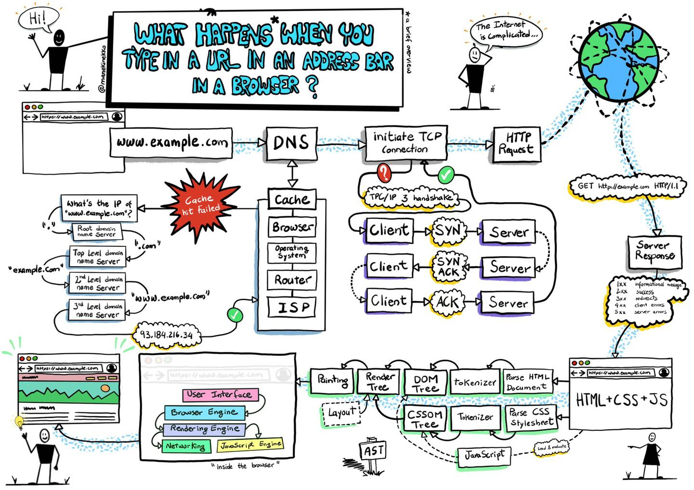

# Computer Science Question and Answer

## Javascript

Q: 誰定義了 let, const 代表宣告

A: TC39

## Internet

Q: What happens when you type in a URL in an address bar in a browser?

A: 

## Resources

1. https://www.ptt.cc/bbs/Soft_Job/M.1640090008.A.A88.html
